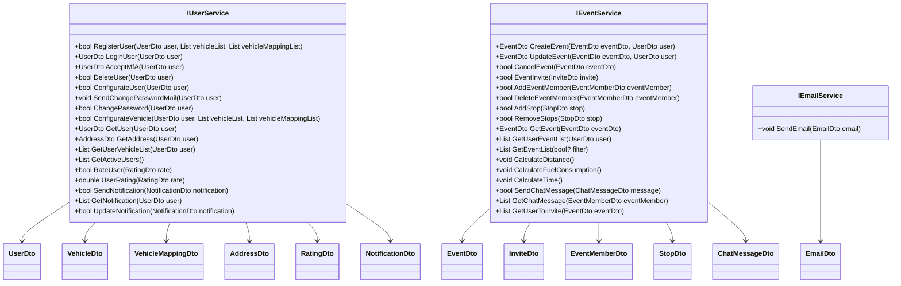

# 1. Technische Dokumentation

## 1.1 Inhaltsverzeichnis

- [1. Technische Dokumentation](#1-technische-dokumentation)
  - [1.1 Inhaltsverzeichnis](#11-inhaltsverzeichnis)
  - [1.2 Einleitung](#12-einleitung)
  - [1.3 Systemübersicht](#13-systemübersicht)
    - [1.3.1 Architektur](#131-architektur)
    - [1.3.2 Komponenten](#132-komponenten)
      - [1.3.2.1 Backend](#1321-backend)
      - [1.3.2.2 Frontend](#1322-frontend)
      - [1.3.2.3 Datenbank](#1323-datenbank)
  - [1.4 Installation und Setup](#14-installation-und-setup)
    - [1.4.1 Backend](#141-backend)
      - [1.4.1.1 Voraussetzungen](#1411-voraussetzungen)
      - [1.4.1.2 Installation](#1412-installation)
      - [1.4.1.3 Konfiguration](#1413-konfiguration)
    - [1.4.2 Frontend](#142-frontend)
      - [1.4.2.1 Voraussetzungen](#1421-voraussetzungen)
      - [1.4.2.2 Installation](#1422-installation)
      - [1.4.2.3 Konfiguration](#1423-konfiguration)
      - [1.4.2.4 Starten](#1424-starten)
    - [1.4.3 Datenbank](#143-datenbank)
      - [1.4.3.1 Voraussetzungen](#1431-voraussetzungen)
      - [1.4.3.2 Installation](#1432-installation)
      - [1.4.3.3 Starten](#1433-starten)
  - [1.5 Verwendung](#15-verwendung)
    - [1.5.1 Frontend Nutzung](#151-frontend-nutzung)
    - [1.5.2 Backend Nutzung](#152-backend-nutzung)
  - [1.6 API Referenz](#16-api-referenz)
- [WayMatcher API Reference](#waymatcher-api-reference)
  - [Controllers](#controllers)
    - [Event Controller](#event-controller)
      - [Endpoints](#endpoints)
    - [Login Controller](#login-controller)
      - [Endpoints](#endpoints-1)
    - [MfA Controller](#mfa-controller)
      - [Endpoints](#endpoints-2)
    - [Register Controller](#register-controller)
      - [Endpoints](#endpoints-3)
    - [User Controller](#user-controller)
      - [Endpoints](#endpoints-4)
  - [1.7 Backend - Klassendiagramm](#17-backend---klassendiagramm)
  - [1.8 Datenbankmodell](#18-datenbankmodell)
  - [1.9 Kontakt und Support](#19-kontakt-und-support)

---

## 1.2 Einleitung

In dieser technischen Dokumentation werden alle erforderlichen Hardware- und Softwarekomponenten beschrieben, die im Projekt *WayMatcher* verwendet wurden. Ziel ist es, einen umfassenden Überblick über das System zu geben, einschließlich seiner Architektur, Funktionalitäten und der Interaktion zwischen Backend, Frontend und Datenbank. Diese Dokumentation richtet sich an Entwickler, Administratoren und alle, die sich mit der Implementierung oder Wartung von *WayMatcher* befassen.

---

## 1.3 Systemübersicht

Dieser Abschnitt gibt einen Überblick über das gesamte System, das Backend, das Frontend und die Datenbank.

### 1.3.1 Architektur

Das System basiert auf einer modernen, cloudbasierten Architektur. Die Datenverwaltung erfolgt über eine Azure-Datenbank, die nahtlos mit dem Backend kommuniziert. Das Backend ist in C# mit .NET 9 implementiert und nutzt ASP.NET Core Web API zur Bereitstellung der API-Schnittstellen. Das Frontend wurde mit React und TypeScript entwickelt und wird über Vite gebündelt. Für das Styling und die Benutzeroberfläche kommt Bootstrap zum Einsatz. Die Kommunikation zwischen Frontend und Backend erfolgt über die bereitgestellten API-Endpunkte.

### 1.3.2 Komponenten

#### 1.3.2.1 Backend

- **Technologien**: Das Backend ist in C# mit .NET 9 entwickelt und nutzt ASP.NET Core Web API zur Bereitstellung der API-Endpunkte.  
- **Wichtige Funktionen**:  
  - Verarbeitung und Bereitstellung von Daten über REST-APIs  
  - Implementierung von Authentifizierungs- und Autorisierungsmechanismen  
  - Geschäftslogik zur Verarbeitung und Validierung von Benutzereingaben  
  - Fehler- und Ausnahmebehandlung zur Sicherstellung der Systemstabilität  
- **Datenfluss**:  
  - Das Backend empfängt Anfragen vom Frontend und verarbeitet diese entsprechend der Geschäftslogik.  
  - Daten werden aus der Azure-Datenbank abgerufen, verarbeitet und als API-Antwort zurückgegeben.  
  - Benutzeranfragen wie Authentifizierung oder Dateneingaben werden validiert und in der Datenbank gespeichert.  

#### 1.3.2.2 Frontend

- **Technologien**: Das Frontend basiert auf React mit TypeScript und wird mit Vite gebündelt. Bootstrap wird für das Styling und die Benutzeroberfläche verwendet.  
- **Wichtige Funktionen**:  
  - Anzeige und Interaktion mit den vom Backend bereitgestellten Daten  
  - Nutzung von API-Endpunkten zur Datenverarbeitung  
  - Benutzerfreundliche Navigation und UI-Komponenten mit Bootstrap  
  - Formularvalidierungen und Echtzeit-Aktualisierungen der Benutzeroberfläche  
- **Datenfluss**:  
  - Das Frontend sendet API-Anfragen an das Backend, z. B. um Benutzerdaten abzurufen oder Änderungen zu speichern.  
  - Die erhaltenen Daten werden verarbeitet und in der Benutzeroberfläche dargestellt.  
  - Benutzerinteraktionen (z. B. Klicks, Formulareingaben) lösen API-Anfragen aus, um Daten in der Datenbank zu aktualisieren.  

#### 1.3.2.3 Datenbank

- **Technologien**: Die Datenbank basiert auf Microsoft Azure SQL und wird zur Speicherung aller relevanten Daten genutzt.  
- **Wichtige Funktionen**:  
  - Speicherung und Verwaltung von Benutzer-, Transaktions- und Systemdaten  
  - Sicherstellung der Datenintegrität durch Beziehungen und Constraints  
  - Bereitstellung effizienter Abfragen für schnelle Datenverarbeitung  
  - Skalierbarkeit für hohe Nutzerzahlen und große Datenmengen  
- **Datenfluss**:  
  - Das Backend sendet Abfragen an die Datenbank, um Daten abzurufen oder zu speichern.  
  - Bei einer erfolgreichen API-Anfrage speichert die Datenbank die neuen oder aktualisierten Daten.  
  - Abfragen werden optimiert, um die Antwortzeiten und Systemleistung zu maximieren.  

---

## 1.4 Installation und Setup

Dieser Abschnitt beschreibt die Schritte zur Installation und Konfiguration des Systems, einschließlich Backend, Frontend und Datenbank.

### 1.4.1 Backend

#### 1.4.1.1 Voraussetzungen

Für das Backend wird das **ASP.NET 9 Framework** benötigt.

#### 1.4.1.2 Installation

1. Das Backend-Repository von GitHub klonen:  
   [WayMatcher Backend](https://github.com/WayMatcher/Backend.git)  
2. Abhängigkeiten gemäß der Projektanforderungen installieren.

#### 1.4.1.3 Konfiguration

1. Die Datei **appsettings.json** entsprechend den Umgebungsvariablen und Datenbankverbindungen anpassen.
2. Sicherstellen, dass alle erforderlichen API-Schlüssel und Konfigurationswerte korrekt gesetzt sind.

### 1.4.2 Frontend

#### 1.4.2.1 Voraussetzungen

Das Frontend erfordert die Installation von **Node.js**, **pnpm** und **React**.

#### 1.4.2.2 Installation

1. Das Frontend-Repository von GitHub klonen:  
   [WayMatcher Frontend](https://github.com/WayMatcher/Frontend.git)  
2. Alle erforderlichen Abhängigkeiten mit **pnpm** installieren.

#### 1.4.2.3 Konfiguration

- Die API-Endpunkte in der Konfigurationsdatei des Frontends anpassen, sodass sie mit dem Backend kommunizieren können.

#### 1.4.2.4 Starten

1. Das Frontend-Projekt starten, um die Benutzeroberfläche im Browser verfügbar zu machen.

### 1.4.3 Datenbank

#### 1.4.3.1 Voraussetzungen

Die **IP-Adresse** muss mit der Firewall verbunden sein, um eine reibungslose Verbindung zur Azure-Datenbank zu gewährleisten.

#### 1.4.3.2 Installation

1. Die Datenbank gemäß der [Datenbank-Dokumentation](https://github.com/WayMatcher/Database/blob/main/README.md) einrichten.
2. Die bereitgestellten Skripte ausführen, um die Datenbankstruktur zu erstellen.

#### 1.4.3.3 Starten

- Die vorbereiteten **SQL-Skripte** ausführen, um alle erforderlichen Tabellen und Relationen anzulegen.

---

## 1.5 Verwendung

### 1.5.1 Frontend Nutzung

- Der Benutzer öffnet die App im Browser.

### 1.5.2 Backend Nutzung

- Das Backend verarbeitet API-Anfragen.

---

## 1.6 API Referenz

# WayMatcher API Reference

This document provides a reference for the WayMatcher API endpoints.

## Controllers

### Event Controller

**Base Route:** `/api/Event`

Handles operations related to events, such as creation, updates, deletion, invites, and member management.

---

#### Endpoints

**1. Create Event**

* **Description:** Creates a new event.
* **Method:** `POST`
* **Endpoint:** `/api/Event/CreateEvent`
* **Request Body:**
    * `requestEvent` (`RequestEvent`): Contains the event details (`Event`) and the user creating it (`User`).

    ```json
    {
      "event": {
        // EventDto properties
      },
      "user": {
        // UserDto properties
      }
    }
    ```

* **Responses:**
    * `200 OK`: Returns the created `EventDto` object.
    * `400 Bad Request`: If input is invalid (e.g., `ArgumentNullException`, `ArgumentException`).
    * `404 Not Found`: If related data is not found or input is invalid in a way that prevents creation.
    * `500 Internal Server Error`: If an unexpected server error occurs.

**2. Update Event**

* **Description:** Updates an existing event.
* **Method:** `POST`
* **Endpoint:** `/api/Event/UpdateEvent`
* **Request Body:**
    * `requestEvent` (`RequestEvent`): Contains the updated event details (`Event`) and the user performing the update (`User`).

    ```json
    {
      "event": {
        // EventDto properties (including EventId)
      },
      "user": {
        // UserDto properties
      }
    }
    ```

* **Responses:**
    * `200 OK`: Returns the updated `EventDto` object.
    * `400 Bad Request`: If input is invalid.
    * `404 Not Found`: If the event to update is not found.
    * `500 Internal Server Error`: If an unexpected server error occurs.

**3. Delete Event**

* **Description:** Deletes (cancels) an event.
* **Method:** `POST`
* **Endpoint:** `/api/Event/DeleteEvent`
* **Request Body:**
    * `eventId` (`int`): The ID of the event to delete.

    ```json
    123
    ```

* **Responses:**
    * `200 OK`: Returns the message "Event deleted.".
    * `400 Bad Request`: If input is invalid.
    * `404 Not Found`: If the event to delete is not found.
    * `500 Internal Server Error`: If an unexpected server error occurs.

**4. Request Event Invite**

* **Description:** Allows a user to request an invitation to an event.
* **Method:** `POST`
* **Endpoint:** `/api/Event/RequestEventInvite`
* **Request Body:**
    * `invite` (`RequestInviteModel`): Contains details about the invite request.

    ```json
    {
      "eventId": 123,
      "userId": 456,
      "message": "Can I join this event?",
      "isPilot": false // Or true if requesting as pilot
    }
    ```

* **Responses:**
    * `200 OK`: Returns the message "Invite sent.".
    * `400 Bad Request`: If the invite request fails (e.g., invalid data, user already invited/member).
    * `500 Internal Server Error`: If an unexpected server error occurs.

**5. Send Event Invite**

* **Description:** Allows an event organizer (or authorized user) to send an invitation to a user.
* **Method:** `POST`
* **Endpoint:** `/api/Event/SendEventInvite`
* **Request Body:**
    * `invite` (`RequestInviteModel`): Contains details about the invite being sent.

    ```json
    {
      "eventId": 123,
      "userId": 789, // User being invited
      "message": "You are invited to join my event!",
      "isPilot": false // Or true if inviting as pilot
    }
    ```

* **Responses:**
    * `200 OK`: Returns the message "Invite sent.".
    * `400 Bad Request`: If sending the invite fails.
    * `500 Internal Server Error`: If an unexpected server error occurs.

**6. Add Event Member**

* **Description:** Adds a user as a member to an event (likely after an invite is accepted or directly by an admin/organizer).
* **Method:** `POST`
* **Endpoint:** `/api/Event/AddEventMember`
* **Request Body:**
    * `member` (`RequestEventMember`): Contains the event ID, user ID, and role.

    ```json
    {
      "eventID": 123,
      "userID": 456,
      "eventRole": 1 // Assuming 1 = Pilot, 2 = Passenger (based on code check `member.EventRole == (int)EventRole.Pilot`)
    }
    ```

* **Responses:**
    * `200 OK`: Returns the message "Member added.".
    * `400 Bad Request`: If adding the member fails.
    * `500 Internal Server Error`: If an unexpected server error occurs.

**7. Add Stop**

* **Description:** Adds a stop (waypoint) to an event's route.
* **Method:** `POST`
* **Endpoint:** `/api/Event/AddStop`
* **Request Body:**
    * `stop` (`RequestStop`): Contains details about the stop to add.

    ```json
    {
      "eventId": 123,
      "stopId": 0, // Usually 0 for new stops, unless updating
      "address": "123 Main St, Anytown",
      "stopSequenceNumber": 1
    }
    ```

* **Responses:**
    * `200 OK`: Returns the message "Stop added.".
    * `400 Bad Request`: If adding the stop fails.
    * `500 Internal Server Error`: If an unexpected server error occurs.

**8. Remove Stop**

* **Description:** Removes a stop from an event's route.
* **Method:** `POST`
* **Endpoint:** `/api/Event/RemoveStop`
* **Request Body:**
    * `stop` (`RequestStop`): Contains the ID of the stop to remove. Only `StopId` is used.

    ```json
    {
      "stopId": 55
      // Other properties are ignored
    }
    ```

* **Responses:**
    * `200 OK`: Returns the message "Stop removed.".
    * `400 Bad Request`: If removing the stop fails.
    * `500 Internal Server Error`: If an unexpected server error occurs.

**9. Get Event List**

* **Description:** Gets a list of events, optionally filtered by whether they need a pilot or have space for passengers.
* **Method:** `GET`
* **Endpoint:** `/api/Event/GetEventList`
* **Query Parameters:**
    * `isPilot` (`bool?`, optional): Filters the list. The exact logic (`_eventService.GetEventList`) needs clarification, but likely filters for events needing pilots (`true`) or passengers (`false`), or returns all (`null`).
* **Responses:**
    * `200 OK`: Returns a list of `EventDto` objects.
    * `404 Not Found`: If no events are found matching the criteria.
    * `500 Internal Server Error`: If an unexpected server error occurs.

**10. Get User Event List**

* **Description:** Gets the list of events associated with a specific user.
* **Method:** `GET`
* **Endpoint:** `/api/Event/GetUserEventList`
* **Query Parameters:**
    * `userId` (`int`): The ID of the user whose events are requested.
* **Responses:**
    * `200 OK`: Returns a list of `EventDto` objects.
    * `404 Not Found`: If the user or their events are not found.
    * `500 Internal Server Error`: If an unexpected server error occurs.

**11. Get Event**

* **Description:** Gets the details of a specific event.
* **Method:** `GET`
* **Endpoint:** `/api/Event/GetEvent`
* **Query Parameters:**
    * `eventDto` (`EventDto`): Contains the ID of the event to retrieve. *Note: Binding a complex object like `EventDto` from query parameters might require specific configuration or might be simpler if just the `eventId` is passed.* Assuming `eventId` is the key property used.
    * Example Query: `/api/Event/GetEvent?EventId=123`
* **Responses:**
    * `200 OK`: Returns the `EventDto` object.
    * `404 Not Found`: If the event is not found.
    * `500 Internal Server Error`: If an unexpected server error occurs.

**12. Get Users To Invite**

* **Description:** Gets a list of users who can potentially be invited to a specific event.
* **Method:** `GET`
* **Endpoint:** `/api/Event/GetUserToInvite`
* **Query Parameters:**
    * `eventDto` (`EventDto`): Contains the ID of the event for which to find potential invitees. *Note: Similar to `GetEvent`, this likely relies primarily on `eventId`.*
    * Example Query: `/api/Event/GetUserToInvite?EventId=123`
* **Responses:**
    * `200 OK`: Returns a list of `UserDto` objects.
    * `404 Not Found`: If the event is not found or no suitable users are found.
    * `500 Internal Server Error`: If an unexpected server error occurs.

---

### Login Controller

**Base Route:** `/api/Login`

Handles user authentication and password management.

---

#### Endpoints

**1. Login User**

* **Description:** Logs in a user using username/email and password.
* **Method:** `POST`
* **Endpoint:** `/api/Login/LoginUser`
* **Request Body:**
    * `userLogin` (`RequestUserLoginModel`): Contains the user's login credentials.

    ```json
    {
      "username": "testuser", // Or null if using email
      "email": "[email address removed]", // Or null if using username
      "password": "userpassword123"
    }
    ```

* **Responses:**
    * `200 OK`: Returns the `UserId` (`int`) of the logged-in user.
    * `400 Bad Request`: If input is invalid.
    * `404 Not Found`: If the user is not found or the credentials are invalid (returns `-1` which is converted to NotFound).
    * `500 Internal Server Error`: If an unexpected server error occurs.

**2. Forgot Password**

* **Description:** Sends a password reset email to the user based on their email, username, or user ID.
* **Method:** `POST`
* **Endpoint:** `/api/Login/ForgotPassword`
* **Request Body:**
    * `user` (`RequestUser`): Contains user identification information (Email, Username, or UserId).

    ```json
    {
      "email": "[email address removed]", // Provide at least one identifier
      "username": "testuser",
      "userId": 123
    }
    ```

* **Responses:**
    * `200 OK`: Returns the message "Password reset email sent.". *Note: This response is sent even if the user doesn't exist to prevent user enumeration.*
    * `400 Bad Request`: If input is invalid.
    * `500 Internal Server Error`: If an unexpected server error occurs (e.g., email sending fails).

**3. Change Password**

* **Description:** Changes the password for a user, likely used after a password reset process.
* **Method:** `POST`
* **Endpoint:** `/api/Login/ChangePassword`
* **Request Body:**
    * `password` (`RequestPassword`): Contains the user identifier (`HashedUsername` - likely a temporary token or username) and the new password.

    ```json
    {
      "hashedUsername": "some_reset_token_or_username",
      "password": "newSecurePassword456"
    }
    ```

* **Responses:**
    * `200 OK`: Returns `true` (boolean) indicating success.
    * `400 Bad Request`: If input is invalid.
    * `500 Internal Server Error`: If the password change fails in the service layer (returns `false` which is converted to 500) or an unexpected error occurs.

---

### MfA Controller

**Base Route:** `/api/MfA`

Handles Multi-Factor Authentication steps.

---

#### Endpoints

**1. MfA Input**

* **Description:** Accepts and verifies the Multi-Factor Authentication token provided by the user.
* **Method:** `POST`
* **Endpoint:** `/api/MfA/MfAInput`
* **Request Body:**
    * `mfaModel` (`RequestMFAModel`): Contains the user ID and the MFA token.

    ```json
    {
      "userId": 123,
      "token": "123456" // The MFA token entered by the user
    }
    ```

* **Responses:**
    * `200 OK`: Returns the result from the MFA verification service (type depends on `IUserService.AcceptMfA` implementation, possibly `UserDto` or a confirmation object).
    * `400 Bad Request`: If input is invalid.
    * `404 Not Found`: If the MFA verification fails (e.g., invalid token, expired token, user not found).
    * `500 Internal Server Error`: If an unexpected server error occurs.

---

### Register Controller

**Base Route:** `/api/Register`

Handles new user registration.

---

#### Endpoints

**1. New User**

* **Description:** Registers a new user along with their associated vehicles.
* **Method:** `POST`
* **Endpoint:** `/api/Register/NewUser`
* **Request Body:**
    * `user` (`RequestUserChange`): Contains the new user's details (`User`), their chosen password (`Password`), and a list of their vehicles (`VehicleList`).

    ```json
    {
      "user": {
        // UserDto properties (e.g., Username, Email, FirstName, LastName, etc.)
        // Note: Password should be set in the separate "password" field below, not here.
      },
      "password": "newUserPassword123",
      "vehicleList": [
        {
          // RequestVehicleModel properties for vehicle 1
          "model": "Model S",
          "seats": 5,
          "yearOfManufacture": 2023,
          "manufacturerName": "Tesla",
          "fuelMilage": 0, // Assuming electric
          "additionalInfo": "Long Range",
          "licensePlate": "T-123XYZ"
          // vehicleId is ignored/overwritten in the backend
        },
        {
          // RequestVehicleModel properties for vehicle 2 (if any)
        }
      ]
    }
    ```

* **Responses:**
    * `200 OK`: Returns `true` (boolean) indicating successful registration.
    * `400 Bad Request`: If registration fails (e.g., username/email taken, invalid input). Returns `false` (boolean). Also used for `ArgumentNullException` / `ArgumentException`.
    * `500 Internal Server Error`: If an unexpected server error occurs during registration.

---

### User Controller

**Base Route:** `/api/User`

Handles user profile management, vehicles, ratings, and notifications.

---

#### Endpoints

**1. Edit User**

* **Description:** Edits the user's profile information and/or vehicle details. Can also be used to change the password if provided.
* **Method:** `POST`
* **Endpoint:** `/api/User/EditUser`
* **Request Body:**
    * `userEdit` (`RequestUserChange`): Contains the user details to update (`User`), optionally a new password (`Password`), and optionally a list of vehicles to update/add (`VehicleList`). The `UserId` within the `User` object identifies the user to edit.

    ```json
    {
      "user": {
        "userId": 123,
        // Include only fields to be updated, e.g.:
        "firstName": "UpdatedFirstName",
        "address": { /* Updated AddressDto */ }
        // Password should NOT be set here
      },
      "password": "optionalNewPassword789", // Optional: Provide only if changing password
      "vehicleList": [ // Optional: Provide only if adding/updating vehicles
        {
          "vehicleId": 45, // ID of existing vehicle to update, or 0/-1 for new
          // Updated RequestVehicleModel properties
          "model": "Model 3",
          "seats": 5,
          "licensePlate": "T-456ABC"
        }
      ]
    }
    ```

* **Responses:**
    * `200 OK`: Returns `true` (boolean) indicating success.
    * `400 Bad Request`: If input is invalid.
    * `500 Internal Server Error`: If updating the user or vehicle configuration fails.

**2. Delete User**

* **Description:** Deletes a user account.
* **Method:** `POST`
* **Endpoint:** `/api/User/DeleteUser`
* **Request Body:**
    * `user` (`RequestUser`): Contains the identifier (UserId, Username, or Email) of the user to delete.

    ```json
    {
      "userId": 123 // Or provide Username/Email
    }
    ```

* **Responses:**
    * `200 OK`: Returns `true` (boolean) indicating successful deletion.
    * `400 Bad Request`: If input is invalid.
    * `500 Internal Server Error`: If deleting the user fails.

**3. Get User**

* **Description:** Gets the profile information for a specific user.
* **Method:** `GET`
* **Endpoint:** `/api/User/GetUser`
* **Query Parameters:**
    * `userId` (`int?`): The ID of the user.
    * `username` (`string?`): The username of the user.
    * `email` (`string?`): The email of the user.
    * *(Provide at least one identifier)*
* **Responses:**
    * `200 OK`: Returns the `UserDto` object (excluding sensitive info like password).
    * `400 Bad Request`: If input is invalid.
    * `404 Not Found`: If the user is not found.
    * `500 Internal Server Error`: If an unexpected server error occurs.

**4. Get Address**

* **Description:** Gets the address associated with a specific user.
* **Method:** `GET`
* **Endpoint:** `/api/User/GetAddress`
* **Query Parameters:**
    * `userId` (`int?`): The ID of the user.
    * `username` (`string?`): The username of the user.
    * `email` (`string?`): The email of the user.
    * *(Provide at least one identifier)*
* **Responses:**
    * `200 OK`: Returns the `AddressDto` object (or similar address structure).
    * `400 Bad Request`: If input is invalid.
    * `404 Not Found`: If the user or their address is not found.
    * `500 Internal Server Error`: If an unexpected server error occurs.

**5. Get Vehicle List**

* **Description:** Gets the list of vehicles associated with a specific user.
* **Method:** `GET`
* **Endpoint:** `/api/User/GetVehicleList`
* **Query Parameters:**
    * `userId` (`int?`): The ID of the user.
    * `username` (`string?`): The username of the user.
    * `email` (`string?`): The email of the user.
    * *(Provide at least one identifier)*
* **Responses:**
    * `200 OK`: Returns a list of `VehicleDto` objects.
    * `400 Bad Request`: If input is invalid.
    * `404 Not Found`: If the user is not found or has no vehicles.
    * `500 Internal Server Error`: If an unexpected server error occurs.

**6. Rate User**

* **Description:** Allows one user to submit a rating for another user.
* **Method:** `POST`
* **Endpoint:** `/api/User/RateUser`
* **Request Body:**
    * `rateUser` (`RequestRateUser`): Contains the rating details.

    ```json
    {
      "ratedUserId": 456, // The user being rated
      "userWhoRatedId": 123, // The user submitting the rating
      "ratingValue": 5, // e.g., 1-5 stars
      "ratingText": "Great passenger!" // Optional comment
    }
    ```

* **Responses:**
    * `200 OK`: Returns `true` (boolean) indicating the rating was successfully submitted.
    * `400 Bad Request`: If input is invalid.
    * `500 Internal Server Error`: If submitting the rating fails.

**7. Get User Rating**

* **Description:** Gets the average rating for a specific user.
* **Method:** `GET`
* **Endpoint:** `/api/User/GetUserRating`
* **Query Parameters:**
    * `userId` (`int`): The ID of the user whose average rating is requested.
* **Responses:**
    * `200 OK`: Returns the average rating value (e.g., `double` or `int`).
    * `400 Bad Request`: If input is invalid.
    * `404 Not Found`: If the user has not been rated yet.
    * `500 Internal Server Error`: If an unexpected server error occurs.

**8. Send Notification**

* **Description:** Sends a notification to a user (potentially triggered by system events or other users).
* **Method:** `POST`
* **Endpoint:** `/api/User/SendNotification`
* **Request Body:**
    * `notificationDto` (`NotificationDto`): Contains the notification details (recipient User ID, message, type, etc.).

    ```json
    {
      "userId": 456, // Recipient User ID
      "message": "Your event starts soon!",
      "notificationType": "Reminder", // Or other relevant type
      "eventId": 123, // Optional related event ID
      "read": false,
      "statusId": 1 // Assuming 1 = Active/Unread
      // NotificationId is likely generated by the backend
    }
    ```

* **Responses:**
    * `200 OK`: Returns the created `NotificationDto` object.
    * `400 Bad Request`: If input is invalid.
    * `404 Not Found`: If sending the notification fails (e.g., recipient not found).
    * `500 Internal Server Error`: If an unexpected server error occurs.

**9. Read Notification**

* **Description:** Marks a specific notification as read.
* **Method:** `POST`
* **Endpoint:** `/api/User/ReadNotification`
* **Request Body:**
    * `notificationId` (`int`): The ID of the notification to mark as read.

    ```json
    789
    ```

* **Responses:**
    * `200 OK`: Returns `true` (boolean) indicating success.
    * `400 Bad Request`: If input is invalid.
    * `404 Not Found`: If the notification ID is not found.
    * `500 Internal Server Error`: If an unexpected server error occurs.

**10. Get Notification**

* **Description:** Gets the list of notifications (read and unread) for a specific user.
* **Method:** `GET`
* **Endpoint:** `/api/User/GetNotification`
* **Query Parameters:**
    * `userID` (`int`): The ID of the user whose notifications are requested.
* **Responses:**
    * `200 OK`: Returns a list of `NotificationDto` objects.
    * `400 Bad Request`: If input is invalid.
    * `404 Not Found`: If the user has no notifications.
    * `500 Internal Server Error`: If an unexpected server error occurs.

**11. Get Status**

* **Description:** A simple health check endpoint to verify the API is running.
* **Method:** `GET`
* **Endpoint:** `/api/User/GetStatus`
* **Responses:**
    * `200 OK`: Returns an empty success response.

---

## 1.7 Backend - Klassendiagramm



## 1.8 Datenbankmodell

[Siehe ER-Diagramm](https://github.com/WayMatcher/Database/blob/main/Database%20ER-Diagram.mmd)

---

## 1.9 Kontakt und Support

- **E-Mail**: <support@waymatcher.hobedere.com>
- **Telefon**: +43 123 456789
